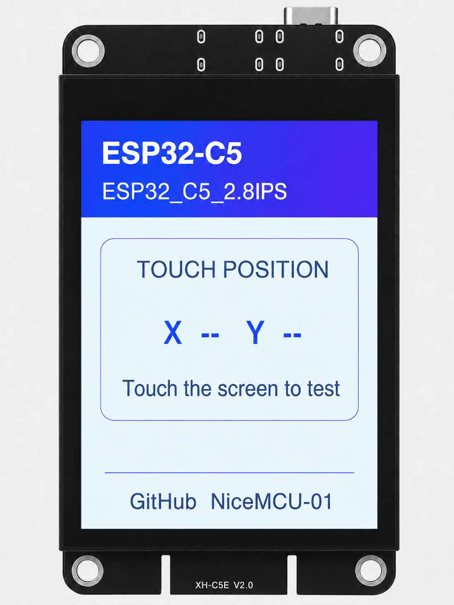

# NiceMCU-C5E-DEV_2.8IPS

[English](./README_EN.md)

面向 `NiceMCU-C5E-DEV_2.8IPS` 开发板的 Arduino 板级自检与硬件验证示例。

本项目提供 ST7789 显示屏、CST816D 电容触摸、MicroSD、WS2812 RGB LED、按键和蜂鸣器的基础测试程序，可用于开发板上电检查、外设联调以及后续功能开发参考。

界面直接使用 Adafruit GFX 绘制，**不依赖 LVGL**。

## 界面预览



当前界面采用轻量卡片式布局：

- 顶部显示开发板型号和示例名称
- 中部实时显示触摸坐标
- 底部显示项目归属信息
- Touch 坐标区域独立刷新，减少整屏重复绘制造成的闪烁

## 功能

- ST7789 240 × 320 IPS 屏幕初始化与界面显示
- CST816D 电容触摸控制器探测
- 实时读取并显示触摸 `X / Y` 坐标
- MicroSD 卡初始化、容量识别和根目录文件枚举
- 板载 WS2812 RGB LED 彩虹动画
- 按键控制 RGB 动画的开启与关闭
- 蜂鸣器开机提示音
- 串口输出各外设初始化和运行状态
- 屏幕与 RGB LED 优先点亮，随后播放开机提示音
- MicroSD 最后初始化，避免慢速存储卡影响屏幕显示速度

## 硬件与软件

| 项目 | 配置 |
| --- | --- |
| 开发板 | NiceMCU-C5E-DEV_2.8IPS |
| MCU | ESP32-C5 |
| 开发框架 | Arduino |
| 显示驱动 | ST7789 |
| 显示分辨率 | 240 × 320 |
| 图形库 | Adafruit GFX |
| 触摸控制器 | CST816D |
| 触摸接口 | I2C |
| 存储 | MicroSD / SPI |
| RGB LED | WS2812 |
| 串口波特率 | 115200 |
| GUI 框架 | 不使用 LVGL |

## Arduino 库依赖

请通过 Arduino IDE 的库管理器安装：

- `Adafruit GFX Library`
- `Adafruit ST7735 and ST7789 Library`
- `Adafruit NeoPixel`

以下库由 Arduino-ESP32 开发板核心提供：

- `SPI`
- `Wire`
- `SD`

## 已验证的编译配置

当前程序已经使用以下 Arduino IDE 配置完成编译：

| 选项 | 配置 |
| --- | --- |
| Board | ESP32C5 Dev Module |
| Arduino-ESP32 | 4.0.0-alpha1 |
| CPU Frequency | 240 MHz |
| Flash Size | 4 MB |
| Flash Frequency | 80 MHz |
| Upload Speed | 921600 |
| PSRAM | Disabled |

也可以尝试使用更新且明确支持 ESP32-C5 的 Arduino-ESP32 版本。升级开发板核心后，建议重新执行完整编译，并在实物开发板上验证。

## 快速开始

1. 安装支持 ESP32-C5 的 Arduino-ESP32 开发板核心。
2. 在 Arduino IDE 库管理器中安装上述三个 Adafruit 库。
3. 打开 `ESP32_C5_2.8IPS.ino`。
4. 开发板选择 `ESP32C5 Dev Module`。
5. 选择开发板对应的串口。
6. 编译并上传程序。
7. 打开串口监视器，将波特率设置为 `115200`。

程序上传完成后，将按以下顺序启动：

```text
初始化 GPIO、WS2812、蜂鸣器和触摸
→ 初始化 TFT
→ 绘制主界面并打开屏幕背光
→ 点亮 WS2812 RGB LED
→ 播放开机提示音
→ 初始化 MicroSD
→ 进入 Touch 坐标与 RGB 动画循环
```

MicroSD 初始化期间，屏幕主界面会保持显示。实时 Touch 坐标会在 `setup()` 执行完成、程序进入 `loop()` 后开始刷新。

## 引脚定义

### TFT 显示屏

| 功能 | GPIO |
| --- | ---: |
| TFT_DC | 4 |
| TFT_CS | 5 |
| TFT_CLK | 6 |
| TFT_MOSI | 7 |
| TFT_RST | 未使用 |
| TFT_BL | 25 |

### CST816D 触摸控制器

| 功能 | GPIO |
| --- | ---: |
| CTP_SCL | 23 |
| CTP_SDA | 24 |
| CTP_INT | 1 |
| CTP_RST | 未使用 |

CST816D 的 I2C 地址为 `0x15`。

### MicroSD

| 功能 | GPIO |
| --- | ---: |
| SD_CS | 13 |
| SD_MOSI | 10 |
| SD_SCK | 9 |
| SD_MISO | 8 |

## USB 与 MicroSD 使用限制

ESP32-C5 开发板的 USB 功能与 MicroSD 的 `SD_CS / GPIO13` 复用，二者不能同时使用。

- 需要通过 USB 下载程序、打开串口监视器或使用 USB CDC 时，请保持 `ENABLE_MICROSD` 为 `0`，不要初始化或访问 SD 卡。
- 需要使用 MicroSD 功能时，可将 `ENABLE_MICROSD` 改为 `1`；此时应避免同时使用 USB 串口，电脑端可能无法正常识别 USB 设备或出现未知 USB 设备提示。
- 该限制来自开发板硬件引脚复用，不是 MicroSD 卡格式、容量或接线质量导致的软件异常。

### 其他外设

| 功能 | GPIO |
| --- | ---: |
| WS2812 数据 | 27 |
| 蜂鸣器 | 26 |
| 用户按键 | 28 |

以上引脚定义仅适用于本项目对应的 C5E 开发板，不应直接用于 `NiceMCU-32S-DEV_2.8IPS` 或其他 ESP32 开发板。

## 串口诊断信息

程序会通过串口输出以下信息：

- CST816D 是否正常响应
- ST7789 是否完成初始化
- 蜂鸣器提示音开始与结束
- Touch 坐标与手势值
- 按键控制的 RGB 动画状态

## 使用说明与注意事项

- 本项目定位为板级自检与硬件验证示例，不是完整的产品固件。
- 当前程序未使用 LVGL，也未包含 Wi-Fi、Bluetooth 或多页面应用框架。
- 不同开发板版本可能存在 GPIO、屏幕或触摸控制器差异，修改程序前请核对对应的硬件资料。
- 如果 MicroSD 挂载失败，请优先检查接线和存储卡格式。排查时建议使用 FAT32 格式、容量不超过 32 GB 的存储卡。
